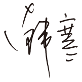
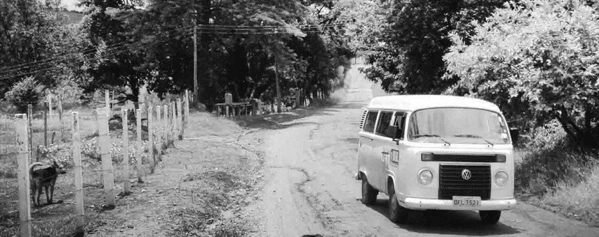

# 序

这部小说完成在2009年至2010年之间，我从2009年的夏天就开始落笔，多事之夏，最终停滞。到2010年初的冬天继续开始，再停滞。一直到2010年的夏天，一样多事之夏，但完成了1988。1988是里面主人公那台旅行车的名字。本来这本书就叫《1988》，序言是我想和这个世界谈谈，不料期间日本的村上先生出了一本《1Q84》，我表示情绪很稳定，但要换书名。又是几经周折，发现再无合适。就好比在孩子要出生之前，你已经为她想好了名字，并且叫了一年，忽然间隔壁邻居比你早生了一个和你叫了差不多名字的小孩，你思前想后，发现其实内心已经无法更改。最后她还是叫《1988：我想和这个世界谈谈》。

如果有未来，那就是“1988：我也不知道”。

故事在书的末尾告一段落，不知道它是否能有新的开始。我从来没有用这种方式和文字写过小说，仿佛之前的一切准备都是为了迎接她。在过往，我觉得自己并没有做好准备，是否能这样去叙述。但是在这个凌晨，我准备好了，让我们上路吧。以此书纪念我每一个倒在路上的朋友，更以此书献给你，我生命里的女孩们，无论你解不解我的风情，无论我解不解你的衣扣，在此刻，我是如此地想念你，不带“们”。

# CHAPTER 01

