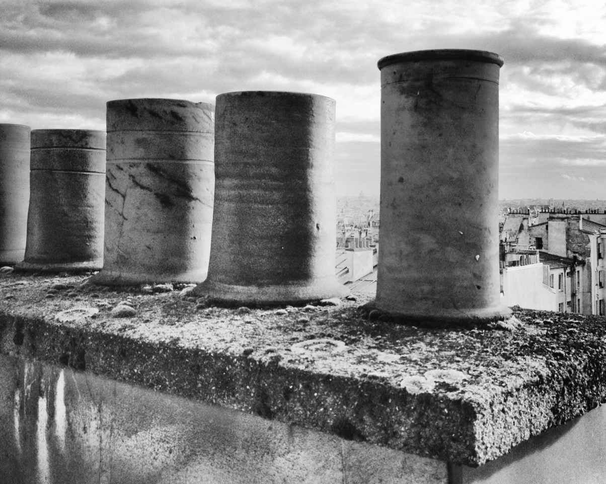

这个世界上没有什么比从高墙里走出来更好，虽然外面也只是没有高墙的院子。墙壁上是斑驳的红色大字，我都不记得上面写了一些什么，应该是四个字四个字四个字和四个字。墨绿色的铁门就似我童年记忆里学校工厂的大门，我们常常去那里偷一些有趣的金属零件。我坐在对面的电话亭下面，想等珊珊从里面出来。不知道这个孕妇此刻在做或被做着什么。我想她只要亮明她的身体状态，她就能从里面出来。无论是多么面目狰狞的人们，除了他们指着鼻子骂我以外，我其实始终都能记得他们不经意间的叹息，我不认为那是人类在压迫下容易满足的贱，而是不经意间流露出来本是同类的交流。但当我想去挖掘的时候，大地马上就把井盖给盖住了，说，朋友，你想都不要想。

在等待珊珊的时光里，我顺着刚才的感触重新回忆了一遍我儿时的校办厂。

那是一个神秘的工厂。在我小学的时候，有一个儿童乐园，那时候我觉得它好大。一直到第一次同学聚会的时候，班级里最发达的同学站在六楼，看着儿童乐园，对我说，你看，我小的时候觉得它好大，现在一看，这个还没有我们家的院子大。小时候就是容易满足。

我在边上附和道，是那时候你人小，现在你人大了，参照物不一样了。

我小的时候在乡下，有一个车站，小时候走过去觉得好远，至少要走半个小时，后来我回了一次老家，没几步就走到了。那是因为我们现在的步伐大了。

最发达说道，嗯，你这个提法很有意思，步伐大了。

在结束了这个现实的互相介绍自己的工作和职位的同学会以后，我一个人去儿童乐园里走了走，用步伐度量了一下，长四十八步，宽二十步，那是我小学里所有可爱回忆的所在，现在终于也变成了一个数据。我记得在一个阳光刺眼的中午，我爬上了滑梯的最高处，纵身一跃跳到了旗杆上，顺着绳子和旗杆又往上爬了几米，那是一个从来没有任何同学到过的制高点，我被飘扬的国旗裹着，眺望整个学校。

暑假就要到来了。

我艰难地挪动了屁股，视线从教学楼转到了厕所，没有什么好看的。让我来说说那时候我们的厕所，在这个最早的青春期里，我记得我们的便池和女生厕所的便池是背靠背的，当中隔开了一堵墙，那堵墙高两米。我量过。现在的我一度想过，如果姚明来我的学校大便的话，当他起身提裤子，他一定能看见对面。

那个时候上厕所，对面的谈话都能听得一清二楚，因为有两个通道，一个是头顶上的通道，另外脚底下便池也是通的，所以对面女生聊天都是立体声。由于一共有八个便池，所以是环绕立体声。她们聊天的声音多么甜美，内容多么无邪，音质多么悦耳，虽然还伴随着急切的嘘声。我曾经幻想，如果有那么一天，那堵墙倒了，将是什么样的情景啊。这个幻想在小学的我脑海里进行过几百次。

在旗杆上的我又挪了挪屁股，于是我看到了那一家校办厂。那时候的建筑在屋顶上有一个小天窗，天窗年久失擦，还长出了青苔，透过一点点光能透过的玻璃，我看见里面的工人们都在紧张地忙碌。他们在一张长条的巨大金属桌子上打磨什么东西，那一定是很好玩的东西。

我正想着，突然之间一声哨响。我低头一看，什么都看不见——被我自己的脚挡住了，但是我听见体育老师刘老师的声音，他语速很快，说，同学，同学，你不要动，我们马上来救你。

我发现我的确已经不能动了，那是四层楼的高度，我已经不能再越回到两层楼高的滑梯上了。我的手也已经出了汗，要不是抓着钩升降国旗绳子的钩子，我估计差不多就像自由落体般滑下去了。老师们很快动员了起来，把我们所有跳高跳远仰卧起坐的垫子放在我的下面，刘老师负责稳定我的情绪，告诉我抓紧了，不要害怕，学校正在组织抢救。

我在旗杆上烤着，汗珠越来越大，脚也开始钩不住。我看了一眼教学楼，发现由于老师们都出来搬运垫子了，所以学生们都已经失控了，六层楼高的校舍走廊上，全部都是五颜六色的同学们和齐刷刷黑色的脑袋。

我的班主任看着垫子，小声说了一句，这个厚度不够，还是会有危险的。

刘老师拨开了班主任，说，如果这个小子掉下来，我会接住他。

不知道哪个看热闹看出了参与感的同学想出来要把自己的书包也垫在下面，不到一分钟的时间，教学楼里一阵喧闹，所有的同学们都喊着，拿书包去救命，拿书包去救命。男男女女们都拎着自己的书包往我这里涌来。我们当时每个年级有四个班，每个班有五十个学生，一共有六个年级，总共一千两百名学生，累计一千两百只书包，在不到五分钟的时间堆在了一起。这些书包足足堆了三米多高。一千多个学生就围在儿童乐园的旁边，学校里广播不停地喊，请所有的学生回到自己的教室，请所有的学生回到自己的教室。但是没有一个学生回去。

老师们围成一圈正在商量，体育老师觉得，书包有软有硬，万一掉下来，脑袋砸在铅笔盒上也是一个悲剧，所以还是应该发挥垫子的作用。可是这些垫子现在被埋到了最底下，发挥不了作用，应该把这些垫子抽出来，然后放在最上端。

现场换成了我的班主任不停地给我喊话，她喊道，你要抓紧了，我们都在全力地营救你，你不要往下看，你就往前看，看看风景，看看这个镇，不要想你在旗杆上，你就觉得你是在家里，不要客气，你就感觉你在家里的沙发上，你感觉到了吗？

我还真感觉不到。但是我真的一点都没有客气。风越来越大，旗杆开始有一点晃动，我还在旗杆的最顶端摇着。整个学校连门房间的大伯和扫地的大妈都出来看我了。不过我一直觉得很奇怪，在那个校办厂里，始终紧闭着大门，那些人还在全神贯注地工作，有一个人抬头看到了，马上又低下头去打磨他的零件。在这样重大的群体性事件中，他们还能保持这样的工作，他们究竟在干什么？

作为一个标杆性的人物，我已经快用完我所有的体力了。老师们在内部商量，学生们在外部观看，我那个时候的视力很好，在茫茫的人海里，我锁定了一个人。我以前怎么没有看到过你，同学，你是哪个班级的，你仰头看我的神态好漂亮，我虽然高高在上，但是已经彻底为你臣服，等我落地了以后，我一定会来找你的，同学。桃红色碎格子衬衫，浅蓝色裙子，马尾辫不戴眼镜的这个女孩子，你仰起的脸庞就像是我用手指抬起了你的下巴，你好奇的眼神就像我用另外一只手在撩起你的刘海。同学，我爱你。这是我生平第一次爱上一个人，只是我没有想到是在这样的一个人生的高度上，而且还身裹国旗。

我的视线一直牢牢地盯着这个女生，心跳加速。

我脚下的老师正在忙着把垫子换到书包的上面，因为要抽出垫子，所以导致书包垒成的缓冲层往下倒塌了一点儿，这引起了同学们的一些不满，认为老师们很自私，要把自己的东西放在上面。体育老师问了一句话，他问我，这样如果跳下来的话，会不会疼。

我已经意识到了，群众经过不懈的努力，以或热诚的，或真挚的，或看热闹不怕事大的心态完成一个作品，就像武器专家其实盼着打仗一样，他们应该会盼着我从上面掉下来，好检验检验他们的产品。但是我不在乎这些，我只在乎这个女生，她被裹在汹涌的人潮里，我的眼睛始终牢牢地盯着她，我的人脸辨识系统和自动跟焦系统全速地工作着。每一眼的对视都给了我力量。虽然我知道，那其实是一种一对一百的对视，地上的人们，你们一定以为我在看你们，其实不是的，我在看她。

在记忆里，我记得她突然不知何故转身走了，也许是被我看毛了。我伸出了手，想隔着几十米的空气留住她。啊！我掉了下去。

那自由落体的感觉——我已经忘了。在一口呼吸的时间里，我掉在了垫子上，周围都是高声的欢呼，但是接触到书包的一刹那，我还是两眼一黑。我摔到了两个垫子的接缝里，直接摔在了书包上，我只记得一本书的书角插了我的小鸟一下，好痛。那是一只黄色的圣斗士系列书包，上面的图片正是我的偶像——不死鸟一辉。我忍痛抽出了那本插我的书，那是一本高年级的课本，我把书塞回到了书包里，紧紧地拽着那只书包，书包上的一辉正盯着我看，那是真的盯着我看，我们都有眼神的交流。而后我能听到的声音越来越轻，我觉得肚子和胸口有点闷，老师们扑了上来，体育刘老师和班主任是最早到我身边的。他们一把把我抱在怀里，然后说，你在说什么，你说大声一点，你在说什么，大声一点，大声一点。

我用尽此刻全身的力气，说了三个字，那三个字我是说给那个女生听的，这是我的心声，我脑海里都是她的影像，我第一次感受到爱的奇妙，她让我超脱了生理的痛苦。我揪着班主任的衣领，艰难地反复呢喃着这三个字——不死鸟。

我醒来的时候是在乡卫生院。旁边放了一张报纸——《乡的风貌》。《乡的风貌》是我们亭新乡文化站办的报纸，在《乡的风貌》第四版上，赫然写着《亭新乡小学一学生爬上旗杆，全校师生团结抢险》，报纸上的题记写道：

本报讯：一位五年级四班的同学在昨天不小心爬上了中心小学的旗杆，无法下来，全校师生积极组织抢险工作，共动用垫子三十六个，书包一千余只，成功地挽救了该小学生的生命。小学生获救后反复说，谢谢老师。

报纸还配了一张照片，照片上的我爬在玉树上临风。我看了看照片的署名，妈的居然是我的同学！他是摄影组的人，原来我爬在旗杆上的时候，他们摄影组正在以我为题材进行创作，难道是我很好对焦吗？

三天以后，我上课了。仅仅是轻微脑震荡。我走进学校的时候顿生自卑，仿佛这里的每一个人都是我的救命恩人。理所当然地，同学们都在看我，他们在议论我，但是他们背地里都叫我猴子，因为我爬得高。我不喜欢尖嘴猴腮的东西，但是他们叫我猴子。这些我都不在乎，我在乎的是，我在找的那个女孩子，你是几年级几班几排几座？

# CHAPTER 03
