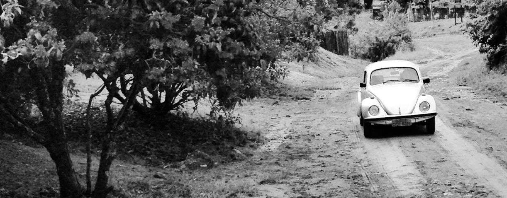

我回想起了我从旗杆上掉下来以后。这个旅途上，我打算在一切等待和寂寥的时候，将我的童年回忆一遍。对了，我忘记告诉你们，我有一个哥哥。作为遵纪守法的好家庭，我当然不可能有一个亲哥哥，这个也不是我的表哥，他是我的邻居丁丁哥哥。他是一个大学生，是我们附近的榜样。那个时候大部分人都去考职校和技校了，因为职校和技校最见效。我哥哥考取大学以后回来的第一周，好多周围的职校和技校生都围着我哥哥，要看看我哥哥的课本，他们想知道我哥哥都学了些什么，大学和技校有什么区别。我哥哥只拿出了两本书，一本《八月之光》，一本《愤怒的葡萄》，说，我的书单都有四页纸。

我们都知道他在装，但我还是被他深深地迷倒了。丁丁哥哥说，你最爱读书，你拿走一本去读吧。

三年级的我选择了一本《愤怒的葡萄》，因为它看着更好看一些。但我只读了一页，因为它完全不是一本讲葡萄的书，而我在我家养鸡的小院子里种了葡萄，葡萄藤已经开始沿着晾衣服的竹架攀爬，我想知道葡萄是怎么想的，葡萄的人生是怎么样的。

隔了一天，丁丁哥哥找到我，收回了那本《愤怒的葡萄》，他说，我昨天晚上想了想，我觉得你也看不懂。

在身边的所有人里，我就管他一个人真心叫哥哥，因为我最钦佩他。他学习成绩好，血气方刚，总是能挺身而出，虽然他总是为了姐姐们挺身而出。丁丁哥哥去过很多很多地方，他每次回来都会给我讲他旅行的故事，他总是代表这里，代表那里，去到必须要坐火车才能到的地方，而我连火车都没有见过。我第一次看到火车便是丁丁哥哥带着我，我坐在他的自行车前杠上，他一直不停地蹬，速度飞快，我紧紧地抓住把手。丁丁哥哥说，如果我们有一台摩托车就好了。我问他，你会开么？他说，当然。

一个多小时以后，我才看见铁轨，我们又等了一个小时，我终于看见第一列红色的火车从我眼前开过。一如所有儿童的本能，我开始数着车厢数，突然我发现异样，问丁丁哥哥道，咦，为什么火车不是绿的呢？

丁丁哥哥说，邪了，我也是第一次看见红色的火车，也许是国家领导人坐在里面的专车，所以是红色的。

我马上立正，对着火车敬了一个礼。

丁丁哥哥连忙问我，你这是干吗？

我说，我在向领导人致敬。

丁丁哥哥说，火车开那么快，领导人根本就看不见你敬礼。

可我还是笔直地在敬礼。

火车的最后一节呼啸而过。

丁丁哥哥大喊一声，礼毕。

我这才放下了手。

那一天我的屁股坐开了花，你能想象在一根单杠上坐了两个小时无所事事该是多么的蛋疼，但是我依然坚持坐在前面，因为如果坐在后座，丁丁哥哥高大魁梧，会把我前面的视线挡得死死的。回来的路上我兴奋难抑，第一次远行丁丁哥哥便带我看到了国家领导人。后来丁丁哥哥去的地方更远更多，他去过香港，他甚至坐过飞机。他对我们说坐飞机的经历，周围围绕着三十多个从各个地方赶来的人。丁丁哥哥告诉我们怎么样登机，还要过安全检查，在跑道上加速的时候推力是多么的大，然后一句起飞，我们的头都同时一仰，感同身受。我有任何不懂的事情，我都会跑到隔壁去问丁丁哥哥。当然，我妈妈叮嘱过他，不要帮我做数学题，可丁丁哥哥自己都有数不清的作业和参加不完的比赛。他还练散打。丁丁哥哥的家境要比我们好一些，所以他们家的楼房是三层，他经常爬上他们家三楼的平台上练散打，我就在我们的水泥场上仰望他，一望就是半个小时，因为老是逆光，看着虽然形象光辉，但是影响视力。我怀疑我的眼睛就是这样看坏的。有一次我捡到了一副被踩破的墨镜，是一个兔子的牌子，有一片镜片是好的，我就把那片镜片捡起来，用于在楼下看丁丁哥哥练散打，这个习惯我保持了好久，以至于学校组织看日全食的时候，我满眼睛依然是丁丁哥哥。

我周围还有不少哥哥，但是那些哥哥们浑浑噩噩，还有一个哥哥甚至要和我们抢弹子。那个哥哥一直在换工作，总是不能变成合同工，是我们这里最大的一个哥哥，小伙伴们都叫他临时工哥哥。

在那个时候，打玻璃弹珠是我们最爱的游戏，我们叫这个为打弹子，我有大概六十颗弹子，那个时候的弹子是两分钱一颗，我最喜欢彩色弹子，当然，大家都喜欢彩色弹子。我们当时打弹子就一个规矩，那就是蹲定了以后脚不可以动，但因为那个时候小，没力气，所以手是可以往前送的。我的周围有四五个小伙伴，每个人的准星都差不多。临时工哥哥他就喜欢和我们玩打弹子，我们一般都带二三十颗弹子，他只带三四颗，可是他有大弹子和小弹子。因为他去过发达的南方，那时候只有南方的弹子有大小，我们这里都是均码。他要打别人的时候就换大弹子，别人打他的时候就换成小弹子，他每天都要赢走我们二三十颗弹子。但是我们躲不了他，因为能打弹子的泥地就那么几块。后来我们规定，不能换大小，临时工哥哥说不行，说《宪法》上没有规定打弹子不能换大小，只怪我们只有一种尺码，而他有各种尺码。我们表示不相信，因为我们是少年先锋队员，法律一定会保护我们的。当时我记得最神的地方是他居然真的拿出了一本《宪法》，我们一条一条对下来，发现《宪法》上真的没有规定在打弹子的时候不能随意变换弹子的大小。我们只能伏法，继续被他欺压。

事情的转机出现在我们最猛的小伙伴身上，他也是我所景仰的小伙伴。他的外号是10号，因为他喜欢踢球，他说，我是10号。

我发现我生命里所崇拜的都是那些热血的人们，虽然我不是一个冷血的人，但我的血液是温的，我总是喜欢看见那些热血的人们，我希望我成为他们中的一员。我总是发现，当我在发呆的时候，他们已经在思考了，当我在思考的时候，他们已经行动了，当我行动的时候，他们已经翘了，然后我又不敢行动了。翘了的他们就成为我生命里至高的仰望。我天生佩服他们，希望他们身上的血能够温热我的身体。

那位小伙伴，10号，他和我们研究过好几次如何惩罚那个临时工哥哥。他有一次把我们召集起来，说，我们要反抗。

我们另外三个小朋友问道，怎么反抗？

他说，在他蹲下来瞄的时候，我从后面用鞋带勒死他，你们要做到的就是不要看我，假装在打弹子，你们能做到么？

我摇摇头，表示我做不到，我觉得这么大的事情要发生了，我肯定不能忍住不看。

他说，那我们在他喝的水里下毒，下老鼠药，唯一要做到的就是当他死了以后，警察问起来，我们谁也不能交代。你能做到么？

我摇了摇头，说我做不到，只要我爹拧我的屁股超过180度，我就什么都招了。

10号当时从书包里掏出了语文书，翻到了刘胡兰的那一页，说，你看看。

我当时还是低年级，没有学到这篇课文。在我年少的记忆里，我只是觉得非常好奇，为什么他们总是能瞬间掏出一本书来。

我仔细地看完了刘胡兰，非常地气愤。我问10号，刘胡兰长什么样，书里的图被你抠下来了。

他解开了自己的衬衫，露出了白背心，白背心上赫然贴着刘胡兰。我想，这应该是中国文化衫的起源。他让我看了一眼，马上就把衣服扣了起来。说，我估计你这样的人，还是会招的，你太㞞了。我还得再想一个办法。

那一天打弹子的情景，我记忆犹新。在我们打到第二局的时候，临时工哥哥一如既往地来了。我仔细地端详着临时工哥哥的相貌，就像端详一具将死的尸体。临时工哥哥单眼皮，有点朝天鼻，大耳朵，牙齿有一颗是黄的，有口气，一米七，穿回力。那天的弹子我打得非常心猿意马，很快就输得只剩三颗。

我一直注意着10号，10号没有带水，没有带刀，穿的鞋子也没有鞋带，周围也没有板砖，10号会怎么杀人呢？轮到了临时工哥哥，临时工哥哥不动声色地从兜里掏出了大号弹子，瞄准了我的那粒彩色弹子，10号已经到了我的弹子后方，临时工哥哥打歪了，他朝自己吐了一口唾沫，10号马上捡起那粒大弹子向着河岸飞奔了起来，我们所有人都怔了几秒，下意识地紧跟着飞奔，临时工哥哥也反应了过来，他三步就已经超过了率先启动的我，直逼10号，10号离河岸还有一百多米，我知道他想把这颗弹子扔到河里，但是临时工哥哥没几步就已经在他身后几米，忽然间，他捂住嘴一弓腰，把大弹子吞了。

我们所有人都愣了，临时工哥哥上前去，说，你吐出来。

10号说，我要死了。

临时工哥哥撒腿就跑了，我鄙视这些撒腿就跑的人。10号躺在我们的怀里，又说了一遍，我快死了，我觉得喘不过气来了，我的肚子好沉啊。

我们七嘴八舌说，快去叫救护车。但是我们都不知道怎么叫救护车。

10号说，不要让大人们知道。我是为了你们而死的。从今天起，他就没有大弹子了，你们一定要战胜他。

我说，我们会的。

我旁边的另外一个小伙伴握着10号的手，说，他还有一个小弹子，我们老是瞄不准那个小的，我也会把它吃掉的。

10号说，我吃大的，你吃小的，你真……

说着，10号的头一歪。我们都哭了起来。我说，我们挖个洞把他埋了吧。另外一个小伙伴说，10号没有死，他还在喘气。

10号又把头转了过来，说，要死的感觉好难受。我有一些遗言要说。我没有喜欢的女同学，我长了这么大，活了这一辈子，没有爱上过任何女人，我只爱一个人，刘胡兰。

我当时脑子里盘旋着一句话，就是说不出口，因为那个时候还没有言语可以形容这种感受。

10号咽了一口口水，扫视了一圈我们，说，其实今天，我觉得我很光荣，我也对得起刘胡兰，和她比起来，我也不差，我也是硬汉。数学刘老师，他当众骂过我，我死了以后，把骨灰撒在他家被单上。纪律委员他骂我，把我的骨灰撒到他的铅笔盒里。临时工，我决定不杀他，但是他却用他的弹子杀了我，把我的骨灰撒到他家屋顶上。我奶奶最好了，她的老母鸡下蛋的时候，别人都不能去摸，就我摸过她的老母鸡，把我的骨灰撒在鸡窝里。我的外公也很好，我去他钱包里偷钱的时候，看到他钱包里藏了我奶奶的照片，他喜欢我奶奶，把我的骨灰撒在他的菜地里。我妈妈不好，她自己买了很贵的鞋，不给我买运动鞋，她说她支持刘老师，把我的骨灰撒在她鞋子里。我的爸爸在远洋轮上，给他写一封信，把我的骨灰撒在信里，我的……我有多少骨灰？

我说，我外公死的时候我看了，大概有几把。

10号说，这么点？

旁边的一个小伙伴说，我要去吃饭了，吃完饭再过来。

那天一直到晚上，我们轮流听着10号的遗言，在现在想来，10号是值的，他只吃了一粒弹子，就换来了4个人轮流的倾听。后来我把这事情告诉了丁丁哥哥。但我没有说10号吃了弹子，因为丁丁哥哥是大人，10号的遗言之一就是不要告诉大人。我只说了临时工哥哥怎么欺负我们。丁丁哥哥说，等等我，我一会儿要去约会看电影，明天我就给你出面摆平这件事情。

这是一个漫长的夜晚，整个晚上我都在等10号的妈妈奔丧。第二天我萎靡不振地来到了泥地上，看见10号已经在那里打弹子了。10号说，我没有死。

我说，我看见了。

10号说，这已经是我第二次死里逃生了。上一次我把口香糖咽下去了，我妈说，口香糖是不能咽下去的，否则就要死，但是我等了三天，还是没死。我是不死鸟一辉。

我当时就急了，说，我才是不死鸟一辉，你不是冷酷的冰河吗？

10号说，我连续两次没有死，所以我决定我不是冰河，我是不死鸟一辉。

我急火攻心，说，我是不死鸟一辉，我从旗杆上摔下来了，也没死，我是不死鸟一辉。

10号说，哈哈得了吧，你以为你很帅啊？你挂在上面，很㞞的。我们都看着，最后是大家的书包救了你，要不然你早就摔死了。但是我吃了弹子都没有死，所以我才是不死鸟一辉。而且我决定，我不放弃冰河，我是冰火战士，我是冰河和火凤凰不死鸟一辉。

这是我生命里第一次的信仰崩塌，因为以前我一直以为我是不死鸟，我觉得我的生命的存在是和别人不一样的，上天让我在这个世界上，肯定有上天的安排，我不知道这个安排是什么，但一定有一个使命，所以，在这个目标实现之前，我是不能够死的。不死，是我唯一的信仰，但是我怕疼，所以我一直没有那些小伙伴们奔放，但是我坚信，我是不死的。后来看到了动画片，才知道，原来我对应的名字叫——不死鸟一辉。我们一共五个小伙伴，大家都是分配好的，最矮的那个叫星矢，最娘的那个叫阿瞬，有一个老是摔伤，经常涂满了紫药水，所以他是紫龙，10号家里是第一个买冰箱的，他经常使用制冰功能，然后放在兜里扔我们，所以他是冰河。我当时话语权最少，一共只有四个青铜圣斗士，所以我什么都没有轮上，但是随着剧情的深入，突然出现了不死鸟一辉，我很激动，他和我的理念不谋而合，我当时就飞奔到千家万户，告诉大家，我是不死鸟一辉，因为对另外四个的地位没有什么影响，我就顺利变成了不死鸟一辉。我深深为这个称号而感到骄傲。但是今天，冰河突然过来说，说他要我的这个称号，而且还保留自己的称号。

那我是什么?

我生命中很少有这么有勇气的时候，因为我觉得支撑我的被抽空了。我揪住10号的衣领，要用我最有力的声音一字一句地告诉他，我是不死鸟一辉！

但是在我揪住他的衣领的时候，他的衣扣突然间崩了，衬衫骤然地敞开，他带着惊慌看了我一眼，夏天的风扬起了他的发梢，他没有还手，但是我看见了刘胡兰，心里一阵慌乱，我看了看四周，小伙伴们也都茫然看着我，我突然想到，他昨天刚刚冒死赶走了临时工哥哥，他是有威信的，我怎么能触犯他？但是我必须要把我心里的话说出来。

我松开了10号，说道，我不是死鸟一辉。

这是我到那个时候为止，生命里最重要的台词，我居然把它说错了。我丢失了这个称号。丁丁哥哥骑着摩托车到我的面前，他手里拎着一个塑料袋。我们围了上去，我走在最后面。丁丁哥哥把塑料袋扔在地上，哗啦啦一声响，几百粒弹子撒在四周。我们都欢呼了起来。丁丁哥哥发动了摩托车，说，我已经帮你谈过话了，他把弹子都还了。你们分吧。说完一拧油门，他的白衬衫像风衣一样飘逸，还潇洒地换了一个挡。我顿时又被他迷倒了。在那个时候，只有他会开带换挡的摩托车。我呆呆地看着他，小伙伴们都已经在抢弹子。

10号出来主持局面，说一切都是因为他的英勇，而且他是双料圣斗士，所以他先选。然后是我们四个人。出于公平，我们先数了弹子，一共四百七十二颗，没有想到他赢了我们那么多。10号挑走了一百五十颗，我不记得他们拿走了多少，我最后得到了三十多颗。我记得我明明是输给临时工哥哥最多的那个人。

我们把各自的弹子藏回家以后，又聚集在泥地上开始新一轮。大家都盘算着怎么把其他人的那些存货赢过来，我就想赢10号的，因为他是第一个挑弹子的，他的弹子最新，最彩色。他要开始打的时候，我万万没有想到，他从兜里掏出了一颗大弹子。他缓缓地用他的大弹子击中了我的那颗，我血液翻腾，不假思索，拾起他的大弹子就吞了。

10号一把锁住我的喉咙，摇晃着我的脑袋，说，赶紧给我，赶紧给我，我刚拉出来就给你吃了，快还给我。

说来奇怪，那一颗弹子我再也没有拉出来过，他们都以为是我藏着不掏出来，后来他们四个人投票废除了打弹子的时候可以使用大小不一的弹子这个规定，后来随着市场经济的深入，我们镇上也出现了大小不一的弹子。我只是好奇，那一颗弹子去哪里了。它也许留在我身体里，化成了我最年少的结石。

丁丁哥哥的身材很好，他和那些书呆子们不同，他喜欢体育，很早就打赤膊。在五月里，他就开始光着上身，对着篮球架引体向上。他可以做三十下，我可以做三下。他教我如何双手握着篮球架上的横杠在上面转一圈，我一个夏天都喜欢拱着篮球架打转，我衣服的腹部都是锈水。丁丁哥哥有一次甚至把篮球架都拔了起来，换了一个地方，因为他说篮球架在的地方不好，他在学习的时候每天都要看到，让他分心。

我相信，丁丁哥哥那天是去找了临时工哥哥，并且把他痛打一顿。但是丁丁哥哥后来告诉我，他只是去谈了谈，他说打架当然能解决问题，谈也能解决问题。我说，那你为什么不像香港电影里那样，直接就打架呢？

丁丁哥哥沉思许久，意味深长地看着我，把手放在我的肩膀上，说，因为会疼嘛。

我点了点头。

丁丁哥哥说，他在学校里是学生会的主席，有的事情，靠谈就搞定了，他有领导能力。丁丁哥哥说，那天，我去找了临时工哥哥，问他缘由，因为像我们这种大人，是不会打弹子的。

我看着丁丁哥哥，丁丁哥哥一点头，继续说，果然。

我一精神，问，那是为什么呢，他要和我们打弹子。

丁丁哥哥说，因为他要赢你们的弹子，他不光和你们打，他还和别的小孩子打，因为他要买一台红灯牌录音机。

我说，嗯。

丁丁哥哥秀了一下肱二头肌，说道，我说，你这是不可以的，你这是欺负小孩子。你要录音机干什么？他说，他要录一盘磁带，唱一首歌寄给他的笔友。

我说，他可以去借一台录啊。

丁丁哥哥说，总是有私心的嘛，他当然也想自己听听，后来我就带他去了文化站，借了我一个朋友的录音机。

我说，哇，文化站的人你也认识啊。

丁丁哥哥云淡风轻道，一个朋友。

我说，那临时工哥哥唱了一首什么歌啊？

丁丁哥哥说，他录了一首《尘缘》。

我说，什么是《尘缘》啊？

丁丁哥哥说，你爸妈不看电视啊，主题歌。

我说，嗯。

丁丁哥哥哼道，尘缘如梦，几番起伏总不平，繁华落尽，一身憔悴在风里，回头时无晴也无雨，漫漫长路，起伏不能由我，人海漂泊，尝尽人情淡薄，热情热心，换冷淡冷漠，任多少真情独向寂寞，人随风过，自在花开花又落，不管世间沧桑如何……

我打断了丁丁哥哥，笑道，哈哈哈哈哈哈，临时工哥哥也会唱歌，临时工哥哥也会唱歌。

我没有意识到，那一刻是丁丁哥哥在唱歌，这是我第一次听他唱歌，但是我却打断了他，丁丁哥哥看着我说，漫漫长路，起伏不能由我。

我跟着唱道，漫漫长路，起伏不能由我。

丁丁哥哥说，这是去年的歌，今年唱着还挺有感觉。

我跟着说，挺有感觉！

丁丁哥哥答应在那个夏天教我足球中的假动作，丁丁哥哥说我踢球太老实了，往左就是往左，往右就是往右，你的身体已经告诉了对手一切。你要把球踢好，要把球控制在自己的脚下，就要学会假动作，你眼睛看着右边，身体晃向右边，你伸出右脚，大家都以为你要往右去了，突然之间，你的左脚一发力，你其实是向左去了，你就把大家都骗了，踢球过人一定要做假动作。等我回来我就教你假动作。

丁丁哥哥在春天收拾好所有的行囊，握着一张火车票向我告别。

我说，丁丁哥哥，你要去南方还是要去北方啊。

丁丁哥哥说，我要去北方。

我说，哇，带我一起去吧。

丁丁哥哥说，不行，你太小了。

我说，我坐火车不用钱的。

丁丁哥哥说，不行，你太大了。

我说，丁丁哥哥，你去做什么啊？

丁丁哥哥说，我去和他们谈谈。

我说，你和谁谈谈啊？

丁丁哥哥唇边露出微笑，急切地说，这个世界。

我说，哇噢。

# CHAPTER 05

