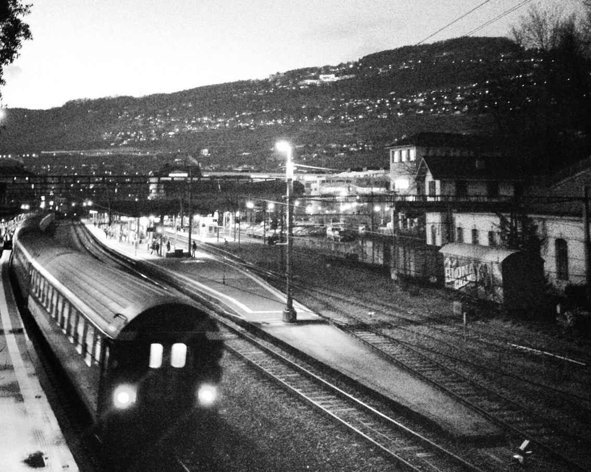

我儿时的家就住在国道的旁边，我当时骑着自行车，在危险的卡车和时常不亮的路灯下幻想，在未来的旅途里，香车美女，奔向远方。不想是破车孕妇，孩子还不是我的，连他妈都不知道孩子是谁的。娜娜在活跃了一阵子以后靠着侧窗睡去，手里还握着一个果冻。但是我带着这个累赘是不能准时到达目的地接到我的朋友的。他只有我这一个朋友，我想，当他出来的时候，若没有我，该会多么孤独。此刻繁星远去，沉云扑来。夜晚深到了它的极点。这一天漫长扎实，我和娜娜远去百多公里，我轻轻地推醒了她。我说，娜娜，我们找一个地方住下来。

娜娜睡眼蒙眬，对着我聚焦了一会儿，问我，这是在哪里？

我说，国道上。

娜娜问我，我们要去哪里？你要去哪里？

我说，我们先住下来吧。

娜娜点头，说，嗯，你继续开，到了叫我。

我们正在接近一个城市，我本以为远处的灯火是大型的化工企业，但路边不断增加的补胎店告诉我，城市到了。路面也从两车道扩充到了四车道，两边的墙上写满了标语。这里正在评选全国文明卫生城市。这个城市相对这条国道并不呈夹道欢迎状，它在国道的右侧，在未来的几公里中，每一条往右的支路都通向城市的中心，左边依然是一些新兴的工厂。路过了几个路口以后，在一大片空地上，我看见了一座皇宫似的建筑，我情不自禁地“哇哦”了一声，开近一看，是法院，射灯将国徽照得熠熠生辉。在法院的旁边还有一个庞大的阴影，我远看没有发现那里还有一个建筑，开近才发现那是比法院大十倍以上的建筑，只有门卫的小灯亮着。这座建筑挡住了月光，把法院大楼的一角淹没在阴影里。自然，那是人民政府的大楼。我沿着国道开了许久，这是第一次看见夜晚不亮灯的政府，让我对这个城市陡生好感。围绕着政府大楼一圈的射灯就像火炮一样瞄准着它，我很想知道当华灯都亮起，这该有多壮观。往旁边开了一个路口，我看到一幢很豪华的宾馆，叫明珠大酒店。我将车停到酒店的门口，准备叫醒娜娜，服务生马上示意我这里不能停车。我说，我知道，我去前台问问。

服务生说，那你也把车停好。

我问他，我的车停哪里？

服务生告诉我，地下车库。

我问他，我停在地面上不行么？

服务生说，停在地下安全。

我驶远一些，到了地面上的空停车位，叫醒娜娜，说，到了。

娜娜睡得投入，醒来以后有些难受，拉开车门将身子探出车外就吐了起来。

我象征性地拍了拍她的背，环顾着四周。

娜娜吐完以后转身泪眼汪汪看着我，说，对不起，对不起，没弄到你车上。

我说，不要紧。

娜娜突然透过我的车窗看见了明珠大酒店，大叫一声，哇。

我说，怎么了？

娜娜说，我们住这么好。

我说，住得好点。你身体不大舒服，住得好点，好好休整休整，我们再继续上路。

娜娜莞尔一笑，露出职业语气，道，没想到你是大老板啊。

我说，哪里哪里，打完折应该也不贵，不过押金应该要交不少，这样，我给你三千块，你去里面开一个房间，大床双床都可以，到时候如果多的话，你就把钱给我，少的话你就出来告诉我，我再给你一些。

娜娜说，不用那么多吧，应该。

我说，你拿着，以防万一。

娜娜在车里想了十多秒，说，嗯，那我去开，你在这里等着。

我说，我在这里等着，我正好把车里收拾一下。

娜娜突然深情地凝望着我，我想，也许是她为我所感动，我让她住那么好的酒店。车里的卡带播放着辛晓琪的《承认》，娜娜特地等到最后一个音符结束，然后突然钩着我的脖子，吻了我一下。吻我以后突然意识到自己刚吐过，连忙说，老板，不好意思。

我说，我不是老板。

娜娜说，谢谢你。

我挥手说，你快去吧，天黑了。

娜娜说，早就黑了。

我说，别赖在车里了，快去吧。

娜娜突然帮我理了理头发，泪水直接坠落。我说，你怎么了？

娜娜说，你知道么，以前我在发廊做的时候，那时候店面很小，而且查得也严，所以都要出去才能做。那些客人，像你这样有车的，一般都是开到郊外，或者就是开到一家小旅店，有的完事了甚至都不愿意把我送回去，我为了省钱，有的时候觉得没开出多远，我就走路想回到店里，但是一走路才知道，汽车开一分钟，我要走半个小时，而且我还穿着高跟鞋，可是我想既然我走了，我就不打车了，因为反正都在起步费里，要不然之前的路就白走了，于是我就一直走一直走，好不容易看到店的门脸了，突然又有一个开车的客人，和我谈好了价钱，把我拉到很远的地方，完事了就把我扔在国道上，说他有事情，要走，不顺路。那次我真的想打车，可是我叫不到车了，我就一路又是走啊走，我的脚都起泡了，走了半个多小时，有车打了，可是我一想，我一打车，刚才的路岂不是又白走。我真的不是心疼八块钱的起步费，真的，我当时出去接一次客，老板娘给我提成有八十块，但是我真的舍不得我刚才走过的路。我好不容易又走到店门口了，又停下来一辆面包车，问我做不做，我说，太累了，不做了。面包车里的人说，你客人那么多啊，都做不动了啊。我说，我做得动，可我走不动了，除非你别开远。他们答应了，然后我们就谈好了价钱。

说到这里娜娜顿了顿，我说，嗯，然后呢？

娜娜叹了口气，说道，我以为呢，我以为那天我生意好，一泼接着一泼。

我改正道，一拨接着一拨。

娜娜说，哦，一波接着一波，反正就是一波未平一波又起。老板，你看我这个成语用得对不？然后面包车上的男的说，没问题，让我上车。他那个面包车贴了大黑膜，我想，反正后面有大黑膜，我就让他往旁边一靠就行了。面包车后面门一开，我穿着高跟鞋，光顾着看底下踏板了，我脚刚踏上去哪知道面包车里还有其他人，他们一拉我的手，我就给拽上面包车了，然后门一关，车就启动了。我想，完蛋了，要么是抢劫犯，要么是强奸犯，我当时就吓傻了。

我问娜娜，接着呢，是不是遇见歹徒了？

娜娜说，更惨，遇上“扫黄”的了。

我倒吸一口冷气。

娜娜说，我很镇定的，我告诉他们，我不是小姐，我是出来玩的。但是他们掏出了录音笔，我刚才开价的那些话都给录进去了。这帮人都有录音癖，太阴了。我直接告诉他们，我没有钱，我刚入行。那个时候我真的刚入行，很勤勤恳恳的，好不容易攒了一点钱，舍不得交罚款。后来他们就说，要不就没收今天身上所有的营业款，还要我伺候他们车里的三个人。

我关切地问道，后来呢？

娜娜说，后来我就和他们讨价还价。

我问她，结果呢？

娜娜说，他们没收了我三百多的营业款，但是留了我十块钱打车回去。

我说，不是说这个，是他们提出的别的要求？

娜娜说，那我只能服从咯，但是我提出来的是一个一个来，而且其他人要在车外面等。反正我就是干这一行的，多一个不多，少一个不少，至少不用罚款。

我沉默不语。

娜娜说，后来我就想，我应该和他们一样，也要有录音癖，应该要买一支录音笔，放在包里，碰上这种情况就录下来，然后向相关部门举报他们，至少他们的工作就都丢了，这叫维权意识。那天我好心疼啊，当然，身子也有点疼，但最主要的是脚疼。早知道我就不走那些路了，都白走了。但是我工作了半个月以后，我就真的买了一支录音笔。

我诧异地看着她，说，你真是敢想敢做，后来你成功了没有?

娜娜一脸沮丧道，后来失败了，上次来讹我的那些人只是城管，后来遇见了警察，没得商量。而且他们还搜出了我的录音笔。在政策宽的时候，别的小姐交代问题以后只关了一天就出来了，但是我那次关了三天。

我问她，为什么？

娜娜说，因为他们说我可能不光光是做小姐，还有可能把嫖客的对话录下来，然后去敲诈嫖客。我当时很生气，说，你们怎么能把我想象成那么肮脏的一个人啊，我一向是宾至如归的，我怎么可能去敲诈他们呢？你们怎么可以这么污蔑我呢？然后我向他们反映了我上次被城管的“扫黄”队敲诈强奸的过程。

我问她，后来呢？

娜娜说，他们记录了一下，但是我说了至少一千个字，他们只记录了几十个字，我估计他们不会去调查的，他们说，没有证据，但是看我也不像说谎，但我还要多留两天，要调查两天，确定我没有涉嫌敲诈的行为以后才可以。倒霉死了。喏，就是这支录音笔。

娜娜在包里翻了半天，将录音笔翻了出来。在我面前晃动几下，说，就是它，不过我现在也用不到它了，我最希望有一台照相机，可以把孩子长大的过程拍下来。不过现在能生下来养活就不错了。这支录音笔，后来我就用来唱歌。我录了我自己唱的好多歌。但是唱得不好听。和明星唱得不好比。但是比我那几个姐妹唱得强多了。这个就送给你了，你保存好啦，给你放在扶手箱里，我走了，我去开房间了。

我说，去吧。

娜娜打开车门，又转身回来，凝望着我。

我又摆摆手，说，快去。

娜娜猛一转身，快步向酒店门口走去。

我说，等等。

娜娜紧张地一回头，问，怎么啦？

我说，刚才你哭什么？你说着说着就没有再解释。

娜娜说，嗯，不知道，没什么，觉得你好，当客人要和我做的时候，都开的那么破的房间，你都不要和我做，却带我去那么好的地方。还带我吃东西，让我坐在车上那么久，还听我说那么久的话，快有好多年了，没有一个男的听我说话超过五句，不过我知道的，我知道我是个什么，你放心好了，谢谢你，对不起你。

我说，别多想了，主要我自己也想睡得好些，快去吧。

我一直目送她的身影，娜娜回头了几次，但我想她应该看不到我在看她。我忍不住有些伤感，娜娜走上了台阶，又回眸向我的方向看了一眼，伫立了几秒，慢慢向酒店大堂走去，一直到我完全不能寻找到她的踪迹。我踩下了1988的离合器，挂上了一挡，对着她走的方向轻声说道，再见。

娜娜转过头去的那个时刻，我说不清是解脱还是不舍，我想，对于不相爱的一男一女，在一个旅途里，始终是没有意义的，她的生活艰辛，我愿意伸手，但我不愿意插手。我有着我的目的地，她有着她的目的地，我们在一起，谁都到达不了谁的目的地。此刻的她应该正在柜台上问服务员还有无房间，不知道她会为我们要一张大床间还是标准间，只可惜我已经上路了。

这是漫长的一天，我已经累了。我往前开出了几百盏路灯的距离。也许是两三公里，看见一个路口，我本想在1988里蜷一晚上，这也算是挽回了一些经济的损失，但我展开了地图，离开我的目的地还有很多的公里。我是不是要上高速公路，不再在这国道上走走停停，但我担心的是1988不能坚持那么长距离的高速驾驶，毕竟这台车的手续有问题，如果在高速公路上抛锚了，连个周旋的地方都没有。混乱的地面道路是最好的地方。1988就像我周围的人，国道就像这个杂乱的世界，在越无序的地方，我越能寻觅到安全感。这安全感的代价就是你要时刻集中精神，否则你就会被庞大的交通工具碾过。我已经身心疲乏，无论是什么样的地方，我多想躺在床上。

我在那个路口右转，看见了凯旋旅店。我已经对这个世界上亮灯的东西眼花缭乱了。我都不知道我是怎么一路打着哈欠一路开到了这家旅店，我甚至分不清楚“旋”字和“旅”字的区别。不过这很正常，在我念书的时候，我就经常写不利索“幼”字和“幻”字。我相信任何凯旋的人都不会住在这里，我选择这个地方是因为我实在没有体力了，而且它看上去很便宜，100元以内就能搞定一晚上。我付了押金，在前台领了一把钥匙，住进了8301房间。我恨透了这样的标记。301就是301。我第一次去大城市找我女朋友的时候，她在酒店等我，我就像沙漠里的一颗仙人掌一样突兀，我被四周的高楼晃晕了，到了酒店，我女朋友说，我在8202。我当时就说，哇哦，82楼。我女朋友说，傻，世界上哪有82楼的酒店啊。

后来我和另外一个女孩子住到了在86楼的酒店，就像住在云端里。我觉得我那些逝去的朋友们应该是在这个高度翱翔着，不会再高，因为他们都有一些近视。

我躺在了8301的床上，舒展了身体，这廉价的床垫是如此地熟悉，在我生命时光里，在这样软硬的床垫上，那些女孩子，要么睡在我的怀里，要么转过身去。我记得我还这样地开导一个想自杀的女孩子，她是个美貌的女孩子，但是她不想活的原因是她觉得大家都只注意她的相貌，而她想让别人知道，她不是只有相貌。所以她很抑郁。今天的我明白，她一定死不了，给她所有的自杀工具都没用，她只是在以另外一种更加矫情的方式自恋，而抑郁和自杀都是她增添美感的一种手段。她说，她感觉生活就像无底洞一样把她往下拽，她不想活了。

我睡眼蒙眬地说道，亲爱的，生活它不是深渊，它是你走过的平原和你想登上的高山，它就像我们睡过的每一张床，你从来不会陷下去，也许它不属于我们，但它一定属于你，你觉得它往下，是因为引力，它绝不会把你拖下深渊，它只想让你伏在地上，听听它的声音，当你休息好了，听够了，你随时可以站起来。你懂么？

她说，我懂了。

我当时很自豪，因为我自己都没懂我在说什么。回头想来，只是我们都不知道周遭的艰辛，才会文艺地感叹。生活它就是深渊。我回忆过去，不代表我对过去的迷恋，也不代表我对现在的失望，它是代表我越来越自闭。天哪，那天躺在床上，其实应该是那个要自杀的女孩子开导我才对，我们总是被那些表面的抑郁所蒙骗，就像我看见的一些人，开导的都是别人，自杀的都是自己。好在我不会自杀，因为我坚信，世界就像一堵墙，我们就像一只猫，我必须要在这堵墙上留下我的抓痕，在此之前，我才不会把爪子对向自己。

我躺在8301的房间里，昏昏欲睡，但我总觉得这个房间缺了什么，我不是说女人，但是作为一个旅店的房间，它一定缺了什么。我浑身不自在，起身寻探，还是不知所然，我又躺到床上，突然发现，在我面前的电视柜上赫然放着一台收音机。我完全能理解这种招待所和廉价旅馆的结合体没有电视机，但我完全不能理解你要把收音机放在那么远的一个位置。

我把收音机放到了床边，插上插座，搜寻着电台，好在再也没有搜寻到任何的敌台，搜到的都是友台。我儿时的那台收音机在两周以后就还给了我。唯一不同的是在敌台的那几个频率上都被嵌进了铁钉，我再也不能停留在那些频率上，这样就彻底杜绝了我的耳朵落入敌人的手中。

# CHAPTER 08
