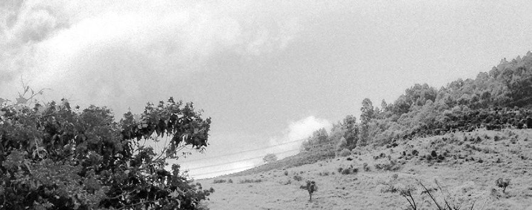

在8301房间里醒来的时侯，我第一反应就是去阳台上看一看1988还在不在，白天看这个房间的设计更加奇怪，它的阳台快要大过它的房间。1988依然腻腻歪歪地停在路边。阳台上还有一个水龙头。我在阳台上洗漱，展开了地图。设计了一下旅程，想自己还是能来得及赶去接上我的那个在远方的朋友。我把地图折起来放在口袋里，推开门，不知是什么样的感情，我想起了娜娜，她此刻一定在明珠大酒店里睁开眼睛，虽然我心怀愧疚，但我也无怨无错，至少她睡了一个比我要好的觉，因为她睡着比我更好的床，而且手里还有一小笔钱，至少能吃饭住宿，当作路费，也足够找到十个孩子他爹。

我甚至隐约觉得如此对待一个小姐一定会被别人耻笑。但我觉得丁丁哥哥不会笑我，我便心里平静。事实上，现在的我，已经比死时的丁丁哥哥大了不少，但在做到任何有争议的事情的时候，我总会把他从记忆里拽出来，意淫他的态度，当然，他总是支持我。我告诉自己，不能看不起娜娜，不能看不起娜娜，但我想我的内心深处还是介意她与我同行。无论如何，这个人已经在我的生命里过去了，唯一留给我的问题便是，我应该是像期盼一个活人一样期盼她，还是像怀念一个死人一样怀念她。但这些都无所谓，长路漫漫，永不再见。

我打开了房间的门，掏出1988的钥匙，走过楼梯的第一个拐角，我就遇见了娜娜。

我以为我梦游去了明珠大酒店。

娜娜和我一样呆在原地，一直到一个下楼洗衣服的赤膊工人打断了我们的沉默。他说，你们两个挪一挪。我和娜娜往边上挪了挪，娜娜泪水直接落在了台阶上，说，对不起。

我说，对不起。

娜娜和昨天看上去不一样，漂亮了一大截，她给自己化了妆，而且化得还不错，但她的妆很快在她的泪水里花了。她又说，对不起。

我说，怎么了娜娜？

娜娜扯住我的衣角，说，对不起。

我说，娜娜，究竟怎么了？

娜娜说，对不起，我欺骗了你。

我顿感角色错位，问道，怎么了？

娜娜说，我拿了你的钱，但我没有去开房间，我溜走了。

我轻轻“啊”了一声。

娜娜说，对不起。

我说，那你，后来，你……

娜娜说，我去了酒店的前台，然后从后门走了，我知道你一定等了我很久，然后你找不到我。

我说，嗯，等了一会儿。

娜娜说，你要把钱要回去么？我现在就可以给你，但是我住宿用了点儿。

我说，不用。你怎么能不告而别呢？

娜娜说，对不起，我害怕你丢下我，我也知道你会丢下我，本来这个事情就和你没有关系，但是我还是害怕，我已经没有钱了，但我不会问你要的。

我入戏了，还有点生气道，于是你就拿了钱走了？

娜娜说，嗯。

我说，难道我还不如这几千块钱重要？

娜娜说，不是。

我问她，那你跑什么？

娜娜说，不是跑，我觉得你迟早要放下我，我还是走吧。

我说，你觉得我是那种人么？

娜娜说，是。

我说，我真的是。

我突然从恶人变成了受害者，不知该怎么描述心情。我对娜娜说，走吧，上路吧。

娜娜说，多不吉利。

我说，那走吧，出发吧。

娜娜问我，我要跟着你做什么呢？

我问她，你能做什么呢？

娜娜说，我什么都做不了，本来我还有能做的，但现在也不能做了。

我说，那你就踏踏实实走吧。

娜娜问我，你会有什么负担么？

我说，没有，但我会增加一点油耗。

娜娜很紧张，问我，那怎么办？

我没有办法回答她。

在街边吃了早饭，就如一夜梦境，我们重新坐进了一台车里。娜娜把自己的妆补了，我问她，你自己给自己化的？

娜娜说，是啊。

我本想和她继续这个话题往下聊，但我停住了，突然对她说，娜娜，你千万不要觉得我爱上你了。娜娜，你不会爱上我了吧？

娜娜说，不会，不会，你放心，这点儿职业操守还是有的。

我说，你们还有职业操守？

娜娜说，那当然有。

我笑道，那你们还有职业楷模？

娜娜说，那自然也有。我们有一个一姐的。

我问，她叫什么名字？

娜娜说，叫孟欣童。

我赞叹了一声，说，原来这个行业里最一线的还都是有正常的艺名的，是不是只有你们这样二三线的才用重叠字啊，什么娜娜啊，珊珊啊。

娜娜说，那是，人家的名字可是算过的，不过她的确漂亮，我是从来没有见过她，但是我有一个顾客看到过，我们都知道她长什么样子，因为有她的照片。这个顾客就喜欢和我聊，每次点我就让我给他按摩，但他给的钱一样多，所以我就很乐意和他聊，他说他上次去卅城，就终于见到了那个传说中的全国头牌，真的好漂亮。他拿了一个号，就等着叫到号，然后飞过去。但是后来他没能飞过去，因为他排到只差了两百多号的时候，孟欣童就消失了，后来再没有消息了。

我问娜娜，去哪里了。

娜娜说，我哪知道。可能是死了，可能是傍到人了。但是我们都给她算过，她的总收入肯定是过千万的，她不光光是卅城的头牌，她可以说是全国的头牌，虽然北京有几个夜总会，名气很大，但是都压不过她，你要找她，还得特地飞到卅城去，你要特地坐飞机，然后转汽车两个小时，才能拿到一个号，那是什么概念，然后提前一天通知你，你得过去，还有拿了号以后轮到的人，特地从欧洲飞回来的。你是不在这个圈子里，你不知道这个奇女子的厉害。她可是我们的偶像。只可惜她最后就不见了。

我说，说不定人家就是换了一个城市重新生活呢？

娜娜笑道，说，干我们这一行的，换一个城市也就是重操旧业，有时候不是因为我们缺钱，也不是我们喜欢干这一行，就觉得我们只会干这个，可能我有一阵子不缺钱，但我还得干，我只觉得这样最有安全感，哪怕完事以后人家嫖客跑了，都要比在家里停工一天觉得踏实。

我说，那你还真挺辛苦的，一个月要干满30天。

娜娜认真地对我说道，不，是25天。

我说，哦，忘了你们的天然假期。那你不交男朋友么？

娜娜说，交啊，以前我的一个同学，后来追求我，我不知道怎么着的，稀里糊涂就答应了，我们在两个城市，是在电脑上重新找到对方的，后来在电脑上确立了恋爱关系。他一直要求来看我，但我哪里来的时间啊，只能等我每个月放假的时候和他见面，他就坐火车过来，我们大概这样坚持了半年，后来就不好了。

我问，为什么不好？

娜娜说，他一共坐火车来了七次，每次我都例假，但我又不敢用嘴，我怕我忍不住太熟练了把人家吓跑，我们就这样憋着，后来他受不了了。我们吵架了，然后就分手了。

我说，你那个小男朋友还挺能忍的，分手他怎么说的。

娜娜说，他说，我知道你是一个好女孩，我知道你这么做都是故意的，你想把你的第一次留给新婚之夜，你是我见过的最纯洁的姑娘，但是，我们总不能一直这样，我来一次也不容易，你下次能不能在不来例假的时候找我来？

我和娜娜同时笑得不可自制。

娜娜指着前方，说，看路，看路，你开歪了。

我大笑着说，哈哈哈，最纯洁的姑娘。

娜娜跟着笑道，说，是啊，这傻子。

我收住了笑，扶着方向盘。

娜娜把双腿蜷在座上，抱着自己的膝盖说，按理来说，其实他挺好的，我应该挺对不起人家的，但是为什么我一点都不内疚呢？

我接着问道，为什么呢？

娜娜说，因为我不爱人家。我丝毫不爱人家，我不爱这种类型的。

我问娜娜，那你爱过谁？

娜娜说，我还真爱过一个人。

我自作聪明道，是不是你高中或者大学的师哥？

娜娜瞪我一眼，道，对不起啊，我没上过。

我忙说对不起。

娜娜流露出了一个微妙的不快，然后又被骨子里的愉悦所覆盖，道，是这样的，我喜欢的那个男人，是我第一次去的洗头店的老板娘的老公。

我说，哦，那就是你的老板。

娜娜严肃道，不是的，那不一样的，那个店就是我们老板娘开的，她老公自己开了一个其他店，做的生意要大很多。

我问，做什么生意？

娜娜说，他开了一个桑拿店。

我说，这不是一样吗？

娜娜立即向我科普道，这哪一样，当然不一样了，规模完全不一样，一个洗头店，十万块钱就能开起来，一年最多赚个二三十万，一个桑拿没有一千万都开不下来的，弄好了一年能赚两三千万，当然，我当时去的是小地方，开桑拿规模不用那么大，但是档次还是不一样，洗头店里全套一百五就给你了，桑拿中心里怎么都要三百多。我老板娘的老公还是很有气质的，而且很能罩得住的。

我说，那后来呢？

娜娜说，嗯，被抓进去了。

我说，他不是罩得住么？

娜娜说，罩子再大也有个半径的，他跑到外地去赌博，给抓了。

我说，你喜欢人家什么？

娜娜说，我喜欢他罩得住。

我不屑道，那不是最后也栽了么？

娜娜说，那不一样，至少在栽之前让我有安全感，他是唯一一个让我有安全感的男人。别人就这么来了又走了，我和他一起待了三年多，那个时候我还不会做这个行业，是他手把手教我的，我第一次试钟就是他试的。

我说，那他老婆呢，就是你的老板娘呢？

就是老板娘安排他来一个一个试钟的啊，但是我没有能够进桑拿中心，还是在洗头店里工作。

我略带伤感问她，娜娜，那既然你这么喜欢他，他怎么没把你安排进桑拿中心呢？桑拿中心提成应该也会高一点，工作起来也安全一点。

娜娜说，是啊，在那个时间里，进桑拿中心就是我唯一的梦想。

我笑话道，你就这么点追求。

娜娜说，那怎么了，至少我一心要往高处走。

我点了一支烟，说，接着说说你的故事。

娜娜说，把烟掐了。

我忙把烟掐了，说，对不起。

娜娜摆弄着安全带，对我说道，那个老板叫孙老板，他一直换名字的，我就叫他孙老板，他很早前是从机关单位下岗的，哦，不，是下海的。我最早去的那个地方是宜春。你不知道那里吧，那是一个很小的县城。我从家里出来，就到了那里，因为火车到那里要查票了，我是从家里跑出来的，当时我身边什么钱都没有带。可其实那个地方离我家并不是很远，因为绿皮火车我只坐了一天，我想可能也就六七百公里的路程。

宜春是个很小的县城，哦，我刚才说过了。我那年多少岁？我想想，我那年反正不到二十岁。我就出来了。我还算是我们那里出来得晚的。我小时候的姐妹们都出来了，全国各地，我从十六岁开始，身边的朋友就不停地少，不停地少，到我出来的时候，已经没有了，只有我弟弟。但我弟弟算不上我朋友。

在宜春我待了三年，四年？差不多四年。你问我为什么喜欢孙老板？我也说不清楚。反正我觉得我要是有这么一个男人，我就知足了。我当时要一个什么检疫证之类的还是什么，反正我也不是很清楚，就是像市场上卖的猪肉一样，表示自己很干净的那种证件，我说我该怎么去弄啊，孙老板一个电话就搞定了。他很有门道的。老板娘开车违章了，他也是一个电话就搞定了，反正什么事情都是一个电话就搞定了，连电话丢了，都能一个电话就搞定了。

不过我不喜欢孙老板也难，他是我那个四年里唯一一个常能看见的男人，其他的男人，基本上都只能看到一眼，后来随着我业务水平的提高，有些男人能多看两眼了，但是你知道那帮男人，多虚伪，说得好好的，下一次还是要点我，下一次过来就点了别人，还假装跟我不认识。不过我也能理解，一样是花钱。当然要玩点不一样的，玩来玩去都是一样的，那和在家里陪老婆有什么区别。但我就接受不了他们瞎说。孙老板很栽培我的，他一直惦记着要把我调到桑拿去，但是老板娘拦着，因为我做到后来，也有了不少的熟客。你别看我姿色一般，其实我化妆一下，还是挺漂亮的，真的，你看，我今天和昨天有没有什么区别？我以前就是学化妆的。我本来是想做化妆师，做化妆师能给好多明星化妆，真的，我特喜欢，这么多人摸不到他们，我让他们闭眼，他们就闭眼，我让他们张嘴，他们就张嘴，我想摸就摸，想捏就捏。这多爽。我把这个想法唯独给一个客人说过，那个客人说，没有安全感的人一般都特别有控制欲。我觉得我应该是没有安全感的。谁有，你说谁有，我就没见过一个有安全感的，连孙老板也没有，要不然孙老板怎么会把钱藏在洗头店的热水瓶里。孙老板够厉害了吧。不过他也没见过明星，你见过明星么？

我看着娜娜，说，娜娜，说话要连贯一点，昨天说你去医院看病那一段就很有逻辑，今天怎么就逻辑混乱了？

娜娜说，昨天是说故事，今天是说感情，说感情当然就混乱了。我说到哪里了，哦，孙老板，你先说，你觉得我今天给自己化的妆怎么样？

我端详了两秒，说，真的不错，比那天冲进我房间漂亮多了，那天你如果化妆成了今天的样子，我就多给你一百。

娜娜马上微微从座椅上腾起身子，说，对了，说起钱，还给你，被你逮住了，我就不黑你的钱了。你给我的钱，我只花了六十，在凯旋旅店住了一晚上。

我说，为什么你只要六十，我住进去就花了九十八。

娜娜说，你们男人就是不会过日子，你可以砍价的嘛。我就在那里砍了好长时间。我说我先住一天，看看好不好，然后我有可能长包一间房间，她就六十给我了。唉，我们真是傻，早知道这样，在凯旋旅店开一个房间就好了，还浪费一间房间。唉，对了，昨天晚上我还老想起你，不过你别误会了，我不是喜欢你，我就是觉得挺难受的，你想我么？

我说，我没有。

娜娜说，嗯，那就好。我看过很多男人的，想你也不会喜欢我，我也就没动那个念想。我见过的男人也有这个数目了。

娜娜说着张开了自己的手掌。

我说，五位数。

娜娜说，白痴，你当我机器啊，哪有那么多。几百个得有吧。

我说，那你把手张开干什么？

娜娜说，哦，我在看掌纹。你看我的爱情线，算了，你还是开车吧，别看了，你看我的爱情线，它和事业线绕在一起。不过我的生命线很短。你看就到这里，大概三十岁，不过在这里，你看，哦，你管你开车，别看，就是这里，这里会有一个新的分支。这就是我的孩子。嘿嘿。对了，跟你说回孙老板的故事，其实我和孙老板也没有什么故事，他每次来都要和我试钟，看看我的水平有没有提高。我本不应该要他钱，因为他过来，老板娘也不会抽成，但是我每次都要问他要十块钱，你知道为什么吗？

我说，为什么？

娜娜说，因为如果他给了我钱，我心里就舒服，我们就是做生意的关系，只有我的男人可以上我不付钱，但他又不是我的男人。虽然老板娘和他也没什么感情，但是他又不可能跟人家离了跟我走，我怕我感情上接受不了，所以我一定要收钱。

我说，你真怪。

娜娜说，直到有一次，我彻底崩溃了，我哭了一天一夜，那次完事了，他告诉我，冰冰，哦对不起，那个时候我叫冰冰，他说，冰冰，对不起，钱包忘车里了，今天就不给你钱了。我当时就急了，说不行，你再掏掏口袋，哪怕一毛钱都行。孙老板说，我光着，哪里来的口袋。我当时就把衣服给他拿过去了。他掏了半天，说，冰冰，我今天真的没有带一分钱。真的没有。我听到这句话，当时就不行了。我抱着他哭，哭得他都傻了。我还是第一次看见他傻掉，你知道孙老板是一个很镇定的人，我从来没有看见过他不知所措那种样子，我眼泪全都沾在他的身上，他说，冰冰，对不起，我真的没带钱，下次我给你补上。我说，你这个白痴，你怎么可能懂。

我说，我也不是特别懂。

娜娜双手撑着扶手箱，说，是啊，你怎么会明白，干我们这一行的，身体都给了人家，总得给自己留点什么。我有一个姐妹，死活不肯用嘴，她就是要把嘴留给她以后老公，结果一次一个男的喝醉了，弄半天不行，那男的非要让她用嘴，她不从，被那个男的打的，十天以后才来上班。警察都来了，后来他赔误工费，可你知道我们这算什么工作啊，怎么算误工费啊。有一个姐妹，从头到尾都必须用套，这倒好，干净，她说只有她老公才能不用套，但问题是这样的话收入就特别少，熟客也不喜欢你，以后也不点你，你的点钟少了，都不一定能留下来继续干，大家都不是那种长得如花似玉的，还不是靠着敬业的精神么，你说是么，你不满足客人，你又不是大美女，你说这怎么弄。你说我出道的时候多傻，呵呵，什么都不知道，我能给我以后老公留什么啊，我什么都没能留下，留一个不知道爹是谁的孩子？我该用的地方都用了，我只能安慰自己，说以后给我的男人唯一留下的福利就是，上我不用给钱。但是孙老板，这个王八蛋，他居然没有给钱。

我听着久久不语。

娜娜怔怔地看着前方，说，不知道他现在怎么样了，我想去找他，可是我也不知道他去哪里了。你说这一路上这么多的县城，这么多的房子，他在哪一栋里呢？

我说，可人家有老婆了。

娜娜说，我可以的。我没问题的。你说我们到这个世界上来一遭，不就是为了找个喜欢的人，有个孩子，这就可以了。我就是不幸，这两个没能结合起来。我可能跟你这么说显得非常的平面，你也不能够深入地了解孙老板这个人，你一定觉得他和普通的开浴场的男人没什么区别，但是他真的不一样，你要相信我，我见过那么多的男人，那么多，除了孙老板，我真正动心的还有一个，他说他是一个音乐制作人，我喜欢王菲，他说他以前是王菲的制作人，我当时就特别激动。他留长长的头发，人瘦瘦高高，我们净在床上聊王菲了。我说，你也是一个有头有脸的人，怎么会来我们这种这么小的洗头店呢。他说，他在体验生活。我很高兴，把姐妹们都叫了上来。说，大家快让王菲的制作人体验体验。他说，太多了，太多了，忙不过来，歌要一首一首做，女人也要一个一个做。你知道么，我们都喜欢王菲，我唱得特别像王菲，容易受伤的女人，得得得得，得得得得得得，得得得得受伤的女人，得得得得……我唱得怎么样。当时我也唱给他听了，他说，很好，说我很有音乐的潜质，下次带上唱片公司的老板过来听我唱歌，说不定可以包装包装。我说，那我得赶紧告诉老板娘，你们如果过来的话，这里就蓬荜生辉，你们包装包装，我们这里还得装修装修。

他说，我们可以包装出一个励志的歌手，你是从社会最底层出来的，当然，我们不会说你是干这行的，但我们可以说你是一个捏脚的，平民天后。到时候我帮你做几首歌，能不能站住脚跟一炮而红还是要看机会的，我不能给你打保票。

我问他，我能见到王菲么？

他说，等王菲录歌的时候我通知你，你过来到棚里就行了。

我说，棚在哪里啊？

他说，北京。

我说，哇哦，你这一路体验得真够远的。

他说，嗯，因为一直在北京待着，艺术的细胞有点枯竭，需要山谷里的清风吹醒我，也需要旅途上陌生的果儿伤害我，果儿你知道么，果儿就是姑娘的意思，我们北京这个圈子里都这么叫，你要先熟悉起来，万一你到了北京听不懂，闹笑话。

我说，嗯，果儿，我是果儿。

他说，好，这个名字真有范儿，你叫什么名字？

我说，叫我冰冰。

他说，你已经有艺名了啊，这样，你还是叫冰冰，但你要改一下你的名字，因为北京已经有两个冰冰了，你知道的吧，所以你的名字里可以有冰字，但是你可以和果结合起来，叫冰果。你觉得怎么样，艺术气息和摇滚范儿完美结合。

我说，冰果，好啊。

他突然又挠头说道，冰果，不行，听着像毒品。

我说，没关系，毒品让人上瘾。

他当时就两眼发光，说，真是不虚此行，真是不虚此行，我想好了，如果给你做一张专辑，专辑的名字就叫《冰毒》，你觉得好么。

我当时眼泪就刷一下流了下来，不是被这个名字感动的，我当时就觉得，如果我真的出了唱片，那么我就有脸去参加以前小学初中的同学会了，我要不要带一个助手？我觉得还是不要了，太装×了，还是让司机和助手远远地等着就可以了。我觉得我还能上台唱歌，还给这个世界留下一张唱片，你知道么，我在这个世界里留下了东西，那我就死了都无所谓了，只要我能够证明我来过这里，我就不怕死。我从来不觉得我应该属于这个世界，这个世界是我们去到真正的世界之前的一个化妆间而已。而且我变成了一个歌手。你知道那种感受么，于是我就哭了。

王菲的制作人一看见我哭了，说，《冰毒》这个名字真的很好，从专辑运营的角度来讲，市场定位非常准确，就是那些迷茫的都市青年。他们天天在夜店里混，天天溜着冰，但是突然有一张叫《冰毒》的唱片，太震撼了。

我泪眼里看着他，都快看不清楚了。

这个时候，老板娘在楼下叫，到钟了，要不要加钟。

我说，你加一个钟吧。

他说，不了，人生海海，我只停留一个钟。这是我的电话。

他把自己的电话号码用一个一块钱硬币写在了好久没有粉过的白墙上，我们那个墙壁粉刷质量那个差哦，石灰粉刷刷地往下掉，掉了我一床单，我的床头正对着窗口，扬起来的粉尘颗粒一颗一颗的，外面太阳好大啊。我的眼泪就这样干在脸上，我说，那你什么时候再来。

他说，我要去北京商量一下，虽然我是一个制作人，但我也有一定的决定权，不过你不要太放在心上，本职工作还是要做好。你等我消息就可以了，你的声线非常好，当然，你的身材也非常好。我是有信心的。我这走了一千多公里，你算是我的一个大收获，所以说皇帝都要经常离京微服私访，好的艺术都在民间，科班出身经常干不过那些半路出家的，这个你要放心我的实力。多少钱？

我说，你给十块就行了。

他大吃一惊，说，你们这里真便宜，北京要一千多。

我说，不是的，我只收你十块，我是亏的，因为我还要给老板娘八十。但我只收你十块。

他掏出来十块钱，放在我手里，说，未来你的出场费是这个的一万倍。

我说，我只要能出唱片，只要能唱歌就行了。

他说，记住，谁也不能妨碍你唱歌，我会去促成这件事情，合作愉快。

我伸出了手，说，合作愉快。

然后他就走了，他穿着一件呢子的风衣，斜挎着一个包，还有大大的围巾。那是冬天，他刚走出门就对着手哈了一口气，白茫茫的。我一直站在我的小隔间的窗口发呆，那天我都没有接客。我傻了整整一天。

此刻的国道上开始堵车，应该是前面发生了交通事故。我所担心的是1988的离合器承受不住那样走走停停的环境。我对娜娜说，结果不用说也知道，那是个骗子是吧？要不然你今天也不会坐在我这辆破车里。

娜娜把窗摇了下来，说，嗯，他是个骗子。

我问，你是怎么识破的呢？他后来一直都没有找你么？

娜娜说，嗯，姐妹让我打电话过去，我说不打了，我等人家联系吧，万一我打电话过去人家正在给王菲录歌呢？我的铃声岂不是都录进去了，打扰人家多不好。

我说，那也挺好，王菲的歌里插一个你的彩铃，你也算是给这个世界留下了一点东西。哈哈哈哈。

娜娜说，这个不好笑的。你别幸灾乐祸。后来我看电视，看女明星八卦的时候看到王菲以前那个制作人了，身形差不多，但脸好像不是同一张。

我说，嗯，这个没办法。

娜娜愤愤不平道，你说这个人，他骗了我，我失眠了一个晚上，而且我好像不光光在想我的唱片，我还在想着那个人，我想，说不定做唱片的时候，像他这样的艺术家可以突破世俗的枷锁，跟我谈恋爱。如果我们谈恋爱，我一定要装神秘感，我要少开口说话，像王菲那样，说不定他会喜欢我这种神秘感。后来我又想，神秘个屁啊，见第一面就上床了。但我还是挺想他的，那几个晚上连孙老板都没顾上想。我小的时候其实还是很喜欢读课外书的，而且很喜欢听音乐的，比起人家说的安全感，我发现这样有艺术气质的人还是对我有吸引力的，不过是个假的。

我哈哈大笑。

娜娜说，你真没有同情心。

我说，我实在忍不住了，但是至少从艺术的角度，这个人还在你的床头墙上留下了一堆数字，总有留下的东西的，而且是永远留着，就算你以后没有在那里上班，但是你的墙还是留着的，你把自己的故事留给了所有能看到那堵墙的人，这就是在这个世界里的痕迹，那栋楼那间房间后来怎么样了？

娜娜一耸肩，说，地震塌了。

国道上堵得异常扎实，半天都没有动一下，我将车熄火了以免开锅，怠速时候的震动瞬间消失了，我问道，娜娜，你不觉得这车太老了，坐着不舒服？

娜娜说，不觉得，嫁鸡随鸡嫁狗随狗，坐车就随车咯，反正我干的工作按理来说都应该是最舒服的事，但都不怎么舒服，所以别的也就无所谓，我可没有那么矫情，你开车，我随意。这样就已经不错了。

我展开了地图，对着国道上的标示，我发现地图上的标示和我走的道路已经不是同一条，我打开车门，站在踏板上往前眺望，在我视线的尽头，路还是死死地堵着。娜娜从我手里接过了地图，问我，要去哪里？

我指着一个城市，说，那里。

娜娜说，好啊，我也去那里。

我说，你去过么？

娜娜说，当然没有了，但是我要去那里，那里我认识朋友。其实不堵车，开一天就到了。你来得及。你的时间大大地足够。

娜娜说，绕路吧。

我说，绕不过，我们要过一座桥，绕的话要绕很远。

娜娜说，没关系，我没有什么目的地。

我说，我有。

娜娜说，哦，你究竟去那里做什么？

我说，我要去接我的一个朋友。

娜娜不屑道，是个女的？

我说，是个男的。

娜娜一笑，你什么取向？

我说，切，你不是已经见识过了。

娜娜一愣，说，嗯，也是。但是你怎么能对一个男的这么执著，并这么老远去，他是你什么人。

我说，他是我的一个好朋友，你屁股下的这个东西就是他做的。

娜娜说，哇，他会做坐垫。

我说，不是，这台车，这台车就是他做的。

娜娜说，好了不起。我也喜欢这些有手艺的人。

我说，你也算是有一技之长的人。

娜娜说，你是在笑我吧。

我说，我可不是。

娜娜玩弄着自己的头发，说，我知道你其实挺看不起我这一行的。

我说，那正常。你以后要婚嫁，还得找得远一些，你打算回你老家么？

娜娜说，其实我不打算，我们女孩子，出来了，基本上就不想着回去了，本来在家里大家也都只顾着弟弟，而且我们这里出来的女孩子，好多人干了这个，能看得出来，你知道么，干久了，大家眼神一对，都知道，知道了往外传，我老家那么小个地方，很快就都知道了，反正我估计我爸妈也是心里有数，但只要不丢他们脸就行。

我说，那你和你爸妈怎么说的，你是出来做什么了？

娜娜说，以前我们都说做按摩师，但现在不行，干这一行的都知道正规的赚不了什么钱，这么说反而让人不放心，所以我就说我做销售。

我笑着说，做销售，哈哈，那销售什么？

娜娜说，自己。

# CHAPTER 10

