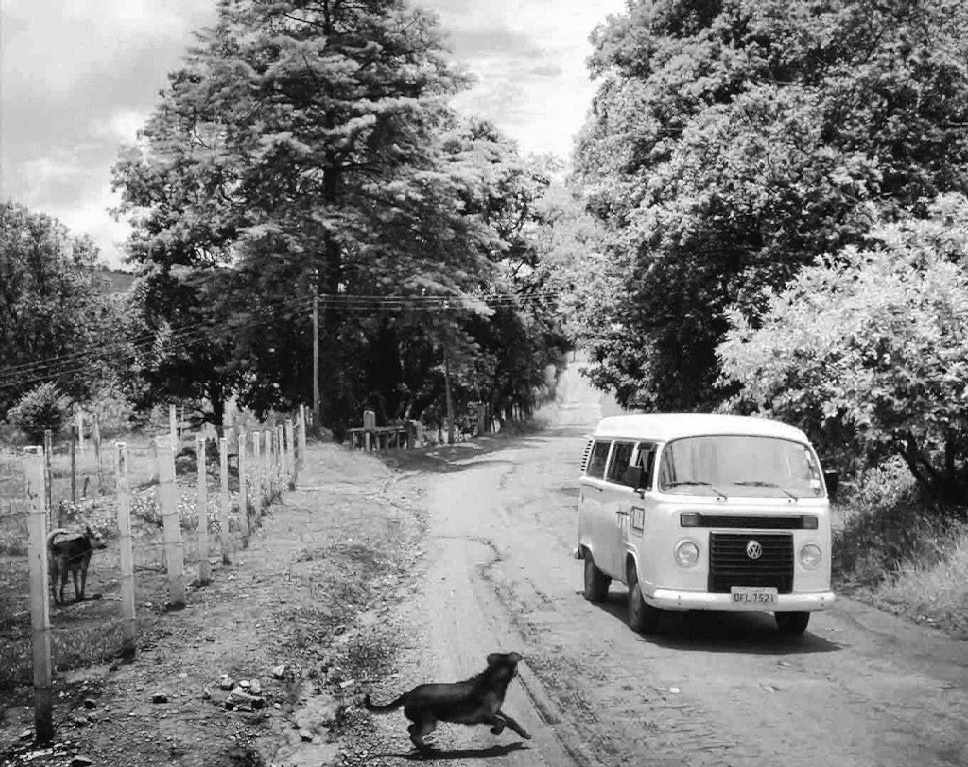

当我离开了家乡以后，我时常在看到各种奇怪的灌木的时候想，这若要是刘茵茵在我一旁，我应该如何向刘茵茵介绍这株树木。对于当时从来没有弄明白自己有什么追求的我来说，姑娘就是唯一的追求。这种追求是多么的煎熬，这让我懂得了人生必须确定一个目标的重要性，无论车子、房子、游艇、飞机，都比把一切押在姑娘身上要好很多，因为这些目标从来不会在几个客户之中做出选择，只要你达到了购买标准，你就可以完全地得到它们，并且在产权上写上自己的名字，如果有人来和你抢，你可以大方地将他们送进监狱。但是姑娘不一样，把一个姑娘当成人生的追求，就好比你的私处永远被人捏在手里一样，无论这个姑娘的手劲多小，她总能捏得你求死不能，当她放开一些，你也不敢乱动，当你乱动一下，她就会捏得更紧一些，最残忍的是，当她想去投向其他的怀抱的时候，总是先捏爆你的私处再说。这种比紧箍咒更残忍的紧什么咒，使你永远无法气定神闲。我知道生命里的各种疼痛，我发现这种疼是最接近心疼的一种疼痛，让你胸闷、无语、蜷缩、哭泣。这便是不平等爱情，当你把手轻抚在她们的私处上，总想让她们更快乐一些的时候，她们却让你这样地痛苦。我常常看见那些为爱情痛苦的同学们，但我无法告诉他们，人生、爱情是什么，我也正沉沦在里面，自闭和防备从来不是解决问题的答案。

不过夏天我依然回到了我的家乡。在此期间，10号是唯一一个和我有通信的人。我其实从未将霸气的10号当成自己的朋友，但是很奇怪，我总觉得10号是我身体里没有被激发的一部分。几乎所有的人都离开了家乡，除了10号。也许这片土地是10号所有安全感的来源。毫无悬念，10号成为了这个镇上的王者，势力渐大，但是他很聪明，并不鲁莽，他从来没有给他的帮派取什么名字，当有小弟提出要给他们的社团叫一个名字的时候，10号告诉他，你这个白痴，你要我死么，我们就是一帮志同道合的朋友，你懂么。等到我第二个夏天回去的时候，10号为我举办了盛大的接风洗尘宴，他包下了一家小龙虾馆，我们几乎吃掉了一条河的小龙虾。10号说，这个，就是我的兄弟，在我们小的时候，他就是一个圣斗士，哈哈哈哈哈。现在，他依然是大家的兄弟，在这个县里，你就是老二。

虽然是客套话，但是我依然对10号的恭维觉得奇怪。我一直想告诉10号，我去的不是军工学院，帮不了你造武器的，我对你们的社团起不到什么帮助。但是我打消了这个念头，在这个夏天湿漉漉的夜晚，10号直接抽出一把枪，说，兄弟，你玩玩。

我忙摆手，问他，真的假的。

10号说，当然是真家伙，假的带在身上，那还不被兄弟们笑死。

我说，你哪里来的？

10号说，你不知道吧？小时候小学的校办厂，它原来就是生产枪的。我他妈也是到后来才知道，你看，我要了这个型号，六四式，一枪一个。

我看了一眼，说，你开过么？

10号举起枪，朝天砰地一枪，回声在这个小镇上飘荡撞击了三四次，我抬头望去，刺眼的月光和若隐若现的树叶摇曳着。10号乐不可支，看着我，说，开过了。

10号搂着我的肩膀，我们坐在一个公共汽车站前，10号说，娘的，这个娘们。我最近撩上了一个女的。哦，我先跟你说，前两天我还看到了一个片子。一部电影，讲少年杀人事件的，但是我被骗了，这根本就不是一部枪战片，这片子太臭了，太闷了，但我每次都想，我要是不看了，我就对不起我刚才浪费的时间，我就看完了，结果还是个闷屁，三个多小时。但是我从里面学会了一句话，一句台词，也是一个娘们说的，我就把这句台词发给了我撩的那个女的，我发短信告诉她，我就像这个世界，这个世界是不会变的，来适应这个世界吧，哈哈哈哈哈。

我说，嗯，还挺文艺的，撩那些爱唱歌写东西的女的还行。

10号说，没想到这个女的给我回了一条，你猜她回的是什么？

我说，她是不是说，好。

10号说，不是。女的都对我言听计从，这个还真有性格。

我说，哈哈，那就是她把你拒绝了，她说，你太霸道了，我喜欢润物细无声。

10号说，是这意思，但你猜，她回给我的短信是什么？

我说，她……是不是回了一个不字？

10号说，这也不是，她把我给她发的那条给发回来了。

我哈哈大笑。10号一脸苦闷说，让我办了她，她就是我的人了。

我打击他道，那你还得要先开好房间，灌醉人家。

10号说，不用，普天之下都是床。

我深深被10号所折服。现在的10号和以前的10号还是有所不同，以前的10号只能欺负身边的小朋友们，我也深受其难，如今他已经懂得恰当的爱恨情仇。我常想，为何对于那些聪明的人，仇和恨总是能把握得如此好，却总是栽在爱里。

我说，10号，你小心把自己栽进去。

10号说，不会的，我知道女人喜欢什么，我太了解了。这些假装文艺的女人，你知道她们是什么吗？

我问他，是什么？

10号指着对面一个写着大大的“拆”字的修车铺，说，就是这些违章建筑，我要强拆了她们。

我笑而不语。10号的性格从小这样，在他小的时候，周围有不少人讨厌他，但这就是我没有讨厌他的原因，我觉得他就是一个粗制滥造没有文化的丁丁哥哥，他们是事物的两个方向，但却是同一样事物。10号那样滥，但有时候能泛出亮光。丁丁哥哥虽然总是充满光芒，但他也有背对着我们的光斑。

其实让肖华哥哥在严打时候被关了好几年的那台摩托车，是丁丁哥哥偷的，因为丁丁哥哥太喜欢摩托车了。我坐在这台摩托车上随丁丁哥哥开了两百多公里，我们过足了瘾，开到没油。丁丁哥哥在另外一个市里把它卖了。我们又坐长途车颠回了家里。我们到家的时候已经半夜，我的家人都在寻找我，但是他们看见我和丁丁哥哥一起回来就放心了。丁丁哥哥说，我在带弟弟体验生活，我带他去了市里的少年宫，那里正有一个少年活动，还和滑稽戏演员刘小毛合拍了一张照片。

当看见是丁丁哥哥带我回家的，所有的家人都转怒为喜，心平气和地说道，丁丁啊，下次带小家伙出去先和大人说一声。不过你带着我就放心了。来，快谢谢丁丁哥哥带你去长见识。

我在旁边玩着手指不出声。

在丁丁哥哥剪断锁的时候，我正在望风，当丁丁哥哥拆开仪表台不用钥匙就能发动摩托车的时候，我心怀景仰，当丁丁哥哥骑着车在路上的时候，我春风沉醉。在开过一台警车的时候，丁丁哥哥对我说，路子野，这件事情你可不能往外说，你这一辈子都不能往外说，你知道么，你说了，我们两个就都完蛋了，你是我的从犯，你这一辈子都是我的从犯，你知道么?

而我正在看沿途的风景。我第一次坐上那么快的交通工具，第一次感觉那么自由的空气，但只害怕丁丁哥哥开得太快，我会从椅子上掉下去，其他的我无所畏惧。虽然只有两百多公里的旅程，但我觉得我的余生都坐在这台摩托车上，丁丁哥哥带着我，我靠着他的后背，去往已知却不详的前方。

10号打断了我的回忆，说，我买了一台很好的摩托车，我先带着这个妞去飙车，一路飙到海边，我要在海滩上办了她。

我说，你们到了哪一步？

10号说，她已经和我接吻了，我摸过她的胸，再往下就死活不让摸了。但明天，她就是我的人了，生是我的人，死是我的鬼。今天几号？7月15号，到明天，明天我就让你知道结果。

2006年夏天7月16日下午3时，10号和刘茵茵发生交通事故，刘茵茵当场死亡，10号在送往医院抢救三小时后死亡，因为事发现场还有手枪一支，曾被一度当成重大刑事案件处理，后无果。整个镇的大部分青年人都素衣参加了这场葬礼，我也去送别这两个朋友。整个过程里我不知道我是怎么想的，老大和老大的女人死了，而我是什么？

# CHAPTER 13

